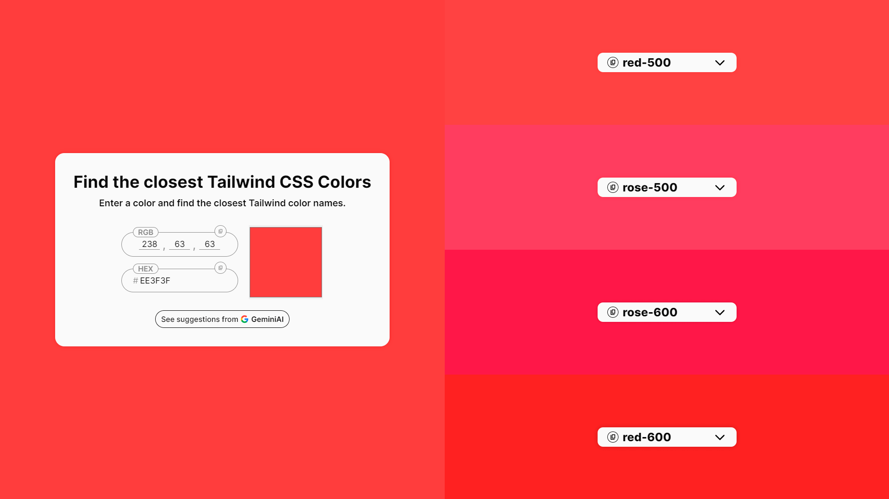
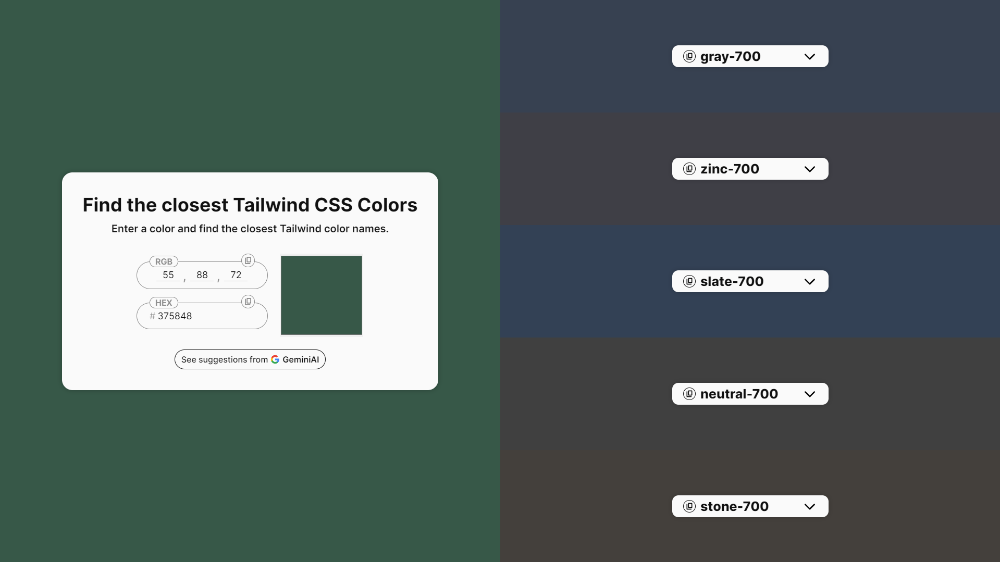
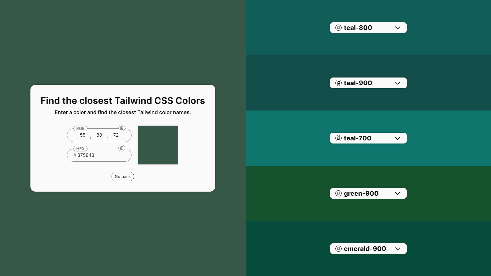
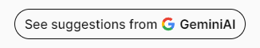

<h1 align="center">Find the Closest Tailwind Colors</h1>

<p align="center">
  <a alt="ReactJS">
    
  </a>
  <a alt="Create React App">
    
  </a>
  <a alt="Javascript">
    
  </a>
  <a alt="HTML5">
    
  </a>
  <a alt="CSS3">
    
  </a>
  <a alt="Gemini AI">
    
  </a>
  <a alt="Tailwind">
    
  </a>
</p>

<p align="center">
  <a href="#projeto">Sobre o projeto</a> •
  <a href="#tecnologias">Tecnologias</a> •
  <a href="#executando">Executando localmente</a>
</div>

<br>
<div align="center">
  
  [](https://find-the-closest-tailwind-colors-v2.vercel.app/)
</div>

<h3 align="center">
  
  [Ver projeto](https://find-the-closest-tailwind-colors-v2.vercel.app/)
</h3>

<br>


## 💻 Sobre o projeto<a id="projeto"></a>

Tailwind CSS é um framework CSS que visa a utilidade, para isso, ele fornece diversas classes utilitárias. Acerca de cores, o Tailwind apresenta uma grande lista de opções, o que facilita a construção de um projeto. Entretanto, ao desenvolver uma aplicação, é comum que o desenvolvedor possua uma cor que deseja utilizar no projeto e que não está na paleta do Tailwind, logo, precisa encontrar uma cor que seja semelhante a desejada. (ainda que seja possível adicionar cores personalizadas, a utilização da própria paleta acaba sendo mais fácil e rápida).

**Foi com esse propósito que o "Find the closest Tailwind CSS Colors" surgiu, tornando-se uma ferramenta que todo desenvolvedor Tailwind precisa**. Fácil e intuitivo, nesse site você pode inserir uma cor em código Hex/RGB ou selecioná-la de um seletor de cores e obter instantaneamente as cores mais próximas da paleta Tailwind. Além disso, é possível ver sugestões de cores próximas dadas pelo Gemini, IA do Google, que, em diversos casos, sugere cores melhores do que as encontradas pelos cálculos.

Você pode acessar/usar a ferramenta clicando [aqui](https://find-the-closest-tailwind-colors-v2.vercel.app/).

### Sobre a versão 2 e a inserção da Google Gemini AI no projeto
Por mais que o principal problema citado tenha sido solucionado no lançamento da v1, ainda havia uma questão que me tirava o sono.

Como o "Find the closest Tailwind CSS Colors" se utiliza de cálculos matemáticos para encontrar as cores mais próximas, cores menos saturadas faziam com que o resultado fossem, principalmente, de diversos tons de cinza(como mostrado na imagem a seguir). Porém, como solucionar isso?

<div align="center">
  
  [](https://find-the-closest-tailwind-colors-v2.vercel.app/)
</div>

Foi, então, assistindo às aulas da [Imersão de Inteligência Artificial com o Google Gemini da Alura](https://cursos.alura.com.br/imersao) que me veio a solução. O Gemini, IA do Google, seria capaz de identificar a qual cor determinada tonalidade pertence, e, consequentemente, encontrar cores próximas melhor do que os cálculos matemáticos. (a imagem abaixo mostra as cores mais próximas encontradas pelo Gemini a partir da mesma cor do exemplo anterior)

<div align="center">
  
  [](https://find-the-closest-tailwind-colors-v2.vercel.app/)
</div>

**A partir disso, um botão foi adicionado abaixo dos inputs de cor para visualizar as sugestões de cores dadas pelo Gemini. Dessa forma, a versão 2 do "Find the closest Tailwind CSS Colors" surgiu, criando um pequeno botão, mas resultado de um grande avanço tecnológico.**

<div align="center">
  
  [](https://find-the-closest-tailwind-colors-v2.vercel.app/)
</div>

Você pode acessar/usar a ferramenta clicando [aqui](https://find-the-closest-tailwind-colors-v2.vercel.app/).

## 🔧 Executando localmente<a id="executando"></a>

Após [clonar o repositório](https://docs.github.com/pt/repositories/creating-and-managing-repositories/cloning-a-repository) e acessar a pasta do projeto, instale as dependências e inicie o servidor de desenvolvimento com os seguintes comandos:

```bash
npm install
npm start
```

Acesse [http://localhost:3000](http://localhost:3000) para visualizar a aplicação.

## 🚀 Tecnologias<a id="tecnologias"></a>

Esse projeto foi desenvolvido com as seguintes tecnologias:

- ReactJS
- Create React App
- Javascript
- HTML
- CSS
- Google Gemini API

## 🤝 Contribuições

Issues e pull requests são muito bem-vindos!

## 👨🏻‍💻 Autor: Gabriel Centeio Freitas 

<p align="left">
  <a alt="Github" href="https://github.com/GabrielCenteioFreitas/">
    
  </a>
  <a alt="Linkedin" href="https://www.linkedin.com/in/gabrielcenteiofreitas/">
    
  </a>
</p>
